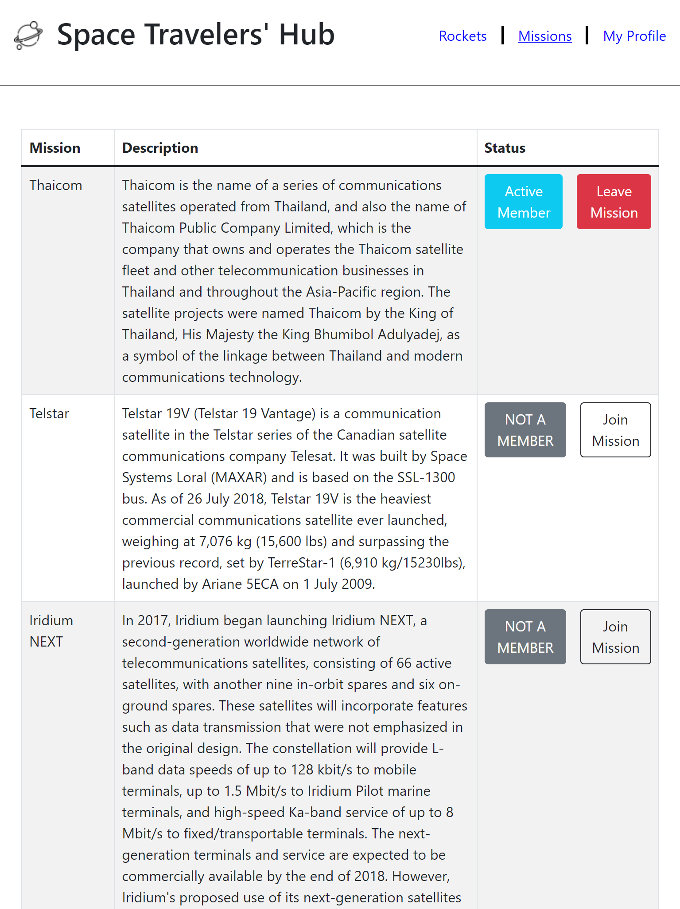
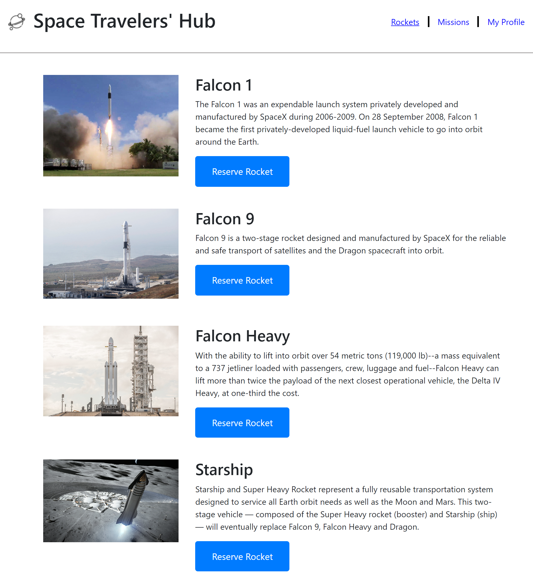

# Space Travelers' Hub

>  Space Travelers' Hub is to a web application for a company that provides commercial and scientific space travel services. This application allows users to book rockets and join selected space missions.

## sneak peek

 <br>

## Features
- Uses real live data from the SpaceX API.
- Book Rockets.
- Join selected space missions.

## Built Using

- ReactJs.
- Redux
- React Router
- CSS.
- GitFlow.

## Run the app in the development mode(Port 3000)

```
npm start
```

## Launches the test runner

```
npm test
```

## Builds the app for production

```
npm run build
```

## Demo App

**live demo** [Space Travelers Hub](https://myelin0.github.io/space-travelers-hub/)

## Authors
👤 **Emirjeta Veisllari**
- GitHub: [@myelin0](https://github.com/myelin0)
- Twitter: [@Amy_Albania](https://twitter.com/Amy_albania)
- LinkedIn: [@Emirjeta Veisllari](https://www.linkedin.com/in/emirjeta-veisllari/)

👤 **Lusindiso Ntanjana**

- GitHub: [@Lusindiso](https://github.com/Lusindiso)
- Twitter: [@LusindisoNt](https://twitter.com/LusindisoNt)
- LinkedIn: [LinkedIn](https://www.linkedin.com/in/lusindisontanjana/)

## 🤝 Contributing

Contributions, issues, and feature requests are welcome!

## Show your support

Give a ⭐️ if you like this project!

## Acknowledgments

- Hat tip to code reviewers and to everyone who reviewed the project and made suggestions.

## 📝 License

This project is [MIT](./LICENSE) licensed.
